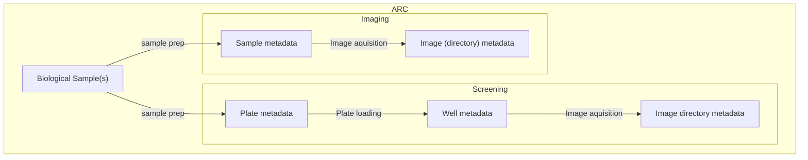
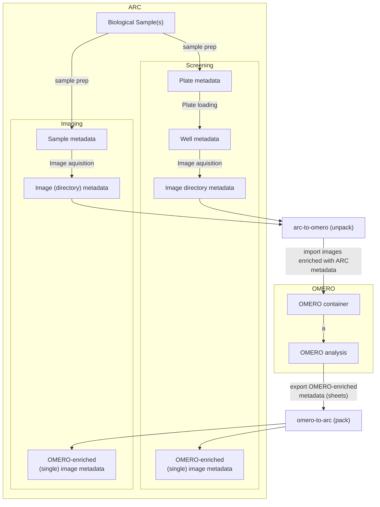

# 12/12/23: ARC <-> OMERO Interop proposal

- [12/12/23: ARC \<-\> OMERO Interop proposal](#121223-arc---omero-interop-proposal)
- [Introduction](#introduction)
- [Integration of OMERO as metadata enrichment process](#integration-of-omero-as-metadata-enrichment-process)
- [Detailed example (Screen-Plate-Well)](#detailed-example-screen-plate-well)
  - [Screen = Study (Sample preparation)](#screen--study-sample-preparation)
  - [Plate = Assay](#plate--assay)
    - [Plate loading sheet](#plate-loading-sheet)
    - [Image acquisition sheet (pre-OMERO)](#image-acquisition-sheet-pre-omero)
    - [Image acquisition sheet (post-OMERO)](#image-acquisition-sheet-post-omero)
- [Things left to-do / up for discussion](#things-left-to-do--up-for-discussion)


# Introduction

In the cologne pre-hackathon, 2 basic OMERO container use cases that should be depicted in the ARC have been identified: 

- Project-Dataset

  - `Project` maps to `Study` (1to1)

  - `Datasets` maps to `Assays` (NtoN)

  - `Images` are `Rows` (NtoN)

- Screen-Plate-Well

  - `Screen` maps to `Study` (1to1)

  - `Plates` map to an `Assay` (Nto1)

  - `Wells` map to `Materials` in the process Graph (NtoN) (Exact location in ARC tbd)

  - `Well location` is mapped to a `Parameter` of the process ()

  - `Images` are `Rows` (NtoN), being measurement outputs of the `Well`



# Integration of OMERO as metadata enrichment process

In general, we want to avoid re-implementing OMERO (analysis) features in the ARC. Since experimenters will have to look at their images, we want to keep the OMERO client as the main interface for this. This also means that image-level metadata cannot be annotated in the arc context before looking at the images in the OMERO client. This leads to the proposition of introducing OMERO import/export as a metadata enrichment process:




# Detailed example (Screen-Plate-Well)

## Screen = Study (Sample preparation)

This is the `Screen` equivalent that tracks sample provenance in the arc context (sample preparation metadata). It is a `Study` in the arc context.

> **Specific example:**
> 
> In this study, two tissues are screened for a phenotype. The samples come from two different organisms.

|Input [Source Name]|Characteristic [Organism]|Output [Sample Name]|
|---|---|---|
tissue_1 | arabidopsis thaliana | sample_at_1
tissue_2 |  mus musculus| sample_mm_1

## Plate = Assay

This is the `Plate` equivalent that tracks plate metadata in the arc context. It is an `Assay` with several sheets, tracking `Plate loading` and `Image aquisition`.

### Plate loading sheet

This sheet tracks the process of loading the wells of a 96-well plate with samples, using the `Well number` ontology term as a parameter.

> **Specific example:**
> 
> In this assay sheet, the samples are loaded onto a 96-well plate, with a different amount of agent applies per well. Loading position is indicated with the `Well number` ontology parameter column.

| Input [Sample name] | Parameter [agent amount] | Parameter [Well number] | Output [Material Name] |
|--|--|--|---|
| sample_at_1 | 10mg | A1 | Well_ID_A1 |
| sample_at_1 | 10mg | A2 | Well_ID_A2 |
| sample_at_1 | 20mg | A3 | Well_ID_A3 |
| sample_mm_1 | 10mg | B1 | Well_ID_B1 |
| sample_mm_1 | 10mg | B2 | Well_ID_B2 |
| sample_mm_1 | 20mg | B3 | Well_ID_B3 |

### Image acquisition sheet (pre-OMERO)

Metadata on the image directory level can be annotated by the experimenter without looking at single images. Examples include the instrument and objective used to produce the contents of a folder containing images of any format.

> **Specific example:**
> 
> In this assay sheet, images are acquired by imaging the wells. The output is a single image directory that contains a set of files needed for getting the whole imaging context. This will be resolved by importing the directory into OMERO afterwards

Input [Material Name] | Parameter [Microscopy instrument] | Output [Data Directory]
|---|---|---|
Well_ID_A1 | scanR HCS | scans_1.scanr |
Well_ID_A2 | scanR HCS | scans_1.scanr |
Well_ID_A3 | scanR HCS | scans_1.scanr |
Well_ID_B1 | scanR HCS | scans_1.scanr |
Well_ID_B2 | scanR HCS | scans_1.scanr |
Well_ID_B3 | scanR HCS | scans_1.scanr |

### Image acquisition sheet (post-OMERO)

After annotating metadata on the image directory level, The image directory should be processed with an adequate tool to add image-level metadata. In the case of OMERO, this means importing the image folder with the ARC metadata and then exporting it again with image-level metadata added to the `Image acquisition` sheet.

> **Specific example:**
> 
> In this assay, single image-level metadata is added via OMERO, as it has been used to view images and add annotations. This must be done by 

| Input [Material Name] | Parameter [$OMERO-PROJECT-ID] | Parameter[$OMERO-TERM-FOR-Xpos] | Parameter[$OMERO-TERM-FOR-Ypos] | Output [Data Directory] | Output Pointer [$OMERO-TERM-FOR-IMAGE-ID] |
|---|---|---|---|---|---|
| Well_ID_A1 | 1337 | 1 | 1 | scans_1.scanr | 0 |
| Well_ID_A1 | 1337 | 2 | 2 | scans_1.scanr | 1 |
| Well_ID_A2 | 1337 | 3 | 3 | scans_1.scanr | 2 |
| Well_ID_A2 | 1337 | 1 | 1 | scans_1.scanr | 3 |
| Well_ID_A3 | 1337 | 2 | 2 | scans_1.scanr | 4 |
| Well_ID_A3 | 1337 | 3 | 3 | scans_1.scanr | 5 |
| Well_ID_B1 | 1337 | 1 | 1 | scans_1.scanr | 6 |
| Well_ID_B1 | 1337 | 2 | 2 | scans_1.scanr | 7 |
| Well_ID_B2 | 1337 | 3 | 3 | scans_1.scanr | 8 |
| Well_ID_B2 | 1337 | 1 | 1 | scans_1.scanr | 9 |
| Well_ID_B3 | 1337 | 2 | 2 | scans_1.scanr | 10 |
| Well_ID_B3 | 1337 | 3 | 3 | scans_1.scanr | 11 |

# Things left to-do / up for discussion

- Note that this proposal requires the implementation of Data Fragment Selectors/Pointers (see [nfdi4plants/ARC-specification#80](https://github.com/nfdi4plants/ARC-specification/issues/80))

- 

- Find out how to extract the image grouping from omero. XML for reference, which is the `pack` output of an omero container that has 2 files with several images each:
    ```xml
    <OME xmlns="http://www.openmicroscopy.org/Schemas/OME/2016-06" xmlns:xsi="http://www.w3.org/2001/XMLSchema-instance" xsi:schemaLocation="http://www.openmicroscopy.org/Schemas/OME/2016-06 http://www.openmicroscopy.org/Schemas/OME/2016-06/ome.xsd">
  <Dataset Name="silke" ID="Dataset:1470">
    <Description/>
    <ImageRef ID="Image:183820"/>
    <ImageRef ID="Image:183818"/>
    <ImageRef ID="Image:183821"/>
    <ImageRef ID="Image:183819"/>
    <ImageRef ID="Image:146172"/>
    <ImageRef ID="Image:146173"/>
    <ImageRef ID="Image:146174"/>
  </Dataset>
  <Image ID="Image:183820" Name="20230307_Image_smaller.vsi [20x_BF_01]">
    <Description/>
    <Pixels ID="Pixels:183820" DimensionOrder="XYZCT" Type="uint8" SizeX="9423" SizeY="8297" SizeZ="1" SizeC="3" SizeT="1">
      <MetadataOnly/>
    </Pixels>
    <AnnotationRef ID="Annotation:-137751657636050585811046293093752044422"/>
    <AnnotationRef ID="Annotation:-209991027017633309993396782743171230408"/>
  </Image>
  <Image ID="Image:183818" Name="20230307_Image_smaller.vsi [label]">
    <Description/>
    <Pixels ID="Pixels:183818" DimensionOrder="XYZCT" Type="uint8" SizeX="8061" SizeY="9414" SizeZ="1" SizeC="3" SizeT="1">
      <MetadataOnly/>
    </Pixels>
    <AnnotationRef ID="Annotation:-326284253322378511150768533995323326063"/>
    <AnnotationRef ID="Annotation:-49010599204527887482530637943313234492"/>
  </Image>
  <Image ID="Image:183821" Name="20230307_Image_smaller.vsi [macro image]">
    <Description/>
    <Pixels ID="Pixels:183821" DimensionOrder="XYZCT" Type="uint8" SizeX="991" SizeY="375" SizeZ="1" SizeC="3" SizeT="1">
      <MetadataOnly/>
    </Pixels>
    <AnnotationRef ID="Annotation:-74328127471813602114668531389833063660"/>
    <AnnotationRef ID="Annotation:-72334924029521433665505818546897158464"/>
  </Image>
  <Image ID="Image:183819" Name="20230307_Image_smaller.vsi [overview]">
    <Description/>
    <Pixels ID="Pixels:183819" DimensionOrder="XYZCT" Type="uint8" SizeX="18123" SizeY="9195" SizeZ="1" SizeC="3" SizeT="1">
      <MetadataOnly/>
    </Pixels>
    <AnnotationRef ID="Annotation:-282597718960263697367635624900601875157"/>
    <AnnotationRef ID="Annotation:-232564353965943461795886204346832898790"/>
  </Image>
  <Image ID="Image:146172" Name="20230425_HZD_01.czi [0]">
    <Description/>
    <Pixels ID="Pixels:146172" DimensionOrder="XYZCT" Type="uint8" SizeX="15005" SizeY="31283" SizeZ="1" SizeC="3" SizeT="1">
      <MetadataOnly/>
    </Pixels>
    <AnnotationRef ID="Annotation:47109"/>
    <AnnotationRef ID="Annotation:47107"/>
    <AnnotationRef ID="Annotation:47104"/>
    <AnnotationRef ID="Annotation:-2710637098880951457627971653992535848"/>
    <AnnotationRef ID="Annotation:-225765019297222116596466107465679929475"/>
  </Image>
  <Image ID="Image:146174" Name="20230425_HZD_01.czi [macro image]">
    <Description/>
    <Pixels ID="Pixels:146174" DimensionOrder="XYZCT" Type="uint16" SizeX="1587" SizeY="799" SizeZ="1" SizeC="3" SizeT="1">
      <MetadataOnly/>
    </Pixels>
    <AnnotationRef ID="Annotation:-36661770010829663616768957687267425448"/>
    <AnnotationRef ID="Annotation:-162564957750521274782661239877459231682"/>
  </Image>
  <Image ID="Image:146173" Name="20230425_HZD_01.czi [label image]">
    <Description/>
    <Pixels ID="Pixels:146173" DimensionOrder="XYZCT" Type="uint8" SizeX="707" SizeY="528" SizeZ="1" SizeC="3" SizeT="1">
      <MetadataOnly/>
    </Pixels>
    <AnnotationRef ID="Annotation:-130730154401772731674291821133271599289"/>
    <AnnotationRef ID="Annotation:-98326161196487507344945063563542802331"/>
  </Image>
  <StructuredAnnotations>
    <MapAnnotation ID="Annotation:-137751657636050585811046293093752044422" Namespace="openmicroscopy.org/cli/transfer">
      <Value>
        <M K="origin_image_id">183820</M>
        <M K="packing_timestamp">14/12/2023, 16:50:20</M>
        <M K="software">omero-cli-transfer</M>
        <M K="version">0.8.0</M>
        <M K="origin_hostname">omero-prod.cloud-app.dkfz.de</M>
        <M K="md5">TBC</M>
        <M K="original_user">m031i</M>
        <M K="original_group">Michele-Bortolomeazzi-Group</M>
      </Value>
    </MapAnnotation>
    <CommentAnnotation ID="Annotation:-209991027017633309993396782743171230408" Namespace="Image:183820">
      <Value>m031i_204/2023-12/05/09-47-28.521/mock_folder</Value>
    </CommentAnnotation>
    <MapAnnotation ID="Annotation:-326284253322378511150768533995323326063" Namespace="openmicroscopy.org/cli/transfer">
      <Value>
        <M K="origin_image_id">183818</M>
        <M K="packing_timestamp">14/12/2023, 16:50:20</M>
        <M K="software">omero-cli-transfer</M>
        <M K="version">0.8.0</M>
        <M K="origin_hostname">omero-prod.cloud-app.dkfz.de</M>
        <M K="md5">TBC</M>
        <M K="original_user">m031i</M>
        <M K="original_group">Michele-Bortolomeazzi-Group</M>
      </Value>
    </MapAnnotation>
    <CommentAnnotation ID="Annotation:-49010599204527887482530637943313234492" Namespace="Image:183818">
      <Value>m031i_204/2023-12/05/09-47-28.521/mock_folder</Value>
    </CommentAnnotation>
    <MapAnnotation ID="Annotation:-74328127471813602114668531389833063660" Namespace="openmicroscopy.org/cli/transfer">
      <Value>
        <M K="origin_image_id">183821</M>
        <M K="packing_timestamp">14/12/2023, 16:50:21</M>
        <M K="software">omero-cli-transfer</M>
        <M K="version">0.8.0</M>
        <M K="origin_hostname">omero-prod.cloud-app.dkfz.de</M>
        <M K="md5">TBC</M>
        <M K="original_user">m031i</M>
        <M K="original_group">Michele-Bortolomeazzi-Group</M>
      </Value>
    </MapAnnotation>
    <CommentAnnotation ID="Annotation:-72334924029521433665505818546897158464" Namespace="Image:183821">
      <Value>m031i_204/2023-12/05/09-47-28.521/mock_folder</Value>
    </CommentAnnotation>
    <MapAnnotation ID="Annotation:-282597718960263697367635624900601875157" Namespace="openmicroscopy.org/cli/transfer">
      <Value>
        <M K="origin_image_id">183819</M>
        <M K="packing_timestamp">14/12/2023, 16:50:21</M>
        <M K="software">omero-cli-transfer</M>
        <M K="version">0.8.0</M>
        <M K="origin_hostname">omero-prod.cloud-app.dkfz.de</M>
        <M K="md5">TBC</M>
        <M K="original_user">m031i</M>
        <M K="original_group">Michele-Bortolomeazzi-Group</M>
      </Value>
    </MapAnnotation>
    <CommentAnnotation ID="Annotation:-232564353965943461795886204346832898790" Namespace="Image:183819">
      <Value>m031i_204/2023-12/05/09-47-28.521/mock_folder</Value>
    </CommentAnnotation>
    <CommentAnnotation ID="Annotation:-97257322130608983004660728770595637266" Namespace="Annotation:47109">
      <Value>file_annotations/47109/Figure_2023-10-25_16-29-54.pdf</Value>
    </CommentAnnotation>
    <FileAnnotation ID="Annotation:47109" Namespace="omero.web.figure.pdf">
      <AnnotationRef ID="Annotation:-97257322130608983004660728770595637266"/>
      <BinaryFile FileName="Figure_2023-10-25_16-29-54.pdf" Size="7666175">
        <BinData BigEndian="true" Length="0"/>
      </BinaryFile>
    </FileAnnotation>
    <CommentAnnotation ID="Annotation:-340111396749034634433571218742147271102" Namespace="Annotation:47107">
      <Value>file_annotations/47107/Figure_2023-10-25_16-12-32.pdf</Value>
    </CommentAnnotation>
    <FileAnnotation ID="Annotation:47107" Namespace="omero.web.figure.pdf">
      <AnnotationRef ID="Annotation:-340111396749034634433571218742147271102"/>
      <BinaryFile FileName="Figure_2023-10-25_16-12-32.pdf" Size="9052500">
        <BinData BigEndian="true" Length="0"/>
      </BinaryFile>
    </FileAnnotation>
    <CommentAnnotation ID="Annotation:-124542744052327560171919097578673763684" Namespace="Annotation:47104">
      <Value>file_annotations/47104/Figure_2023-10-25_15-45-53.pdf</Value>
    </CommentAnnotation>
    <FileAnnotation ID="Annotation:47104" Namespace="omero.web.figure.pdf">
      <AnnotationRef ID="Annotation:-124542744052327560171919097578673763684"/>
      <BinaryFile FileName="Figure_2023-10-25_15-45-53.pdf" Size="21468721">
        <BinData BigEndian="true" Length="0"/>
      </BinaryFile>
    </FileAnnotation>
    <MapAnnotation ID="Annotation:-2710637098880951457627971653992535848" Namespace="openmicroscopy.org/cli/transfer">
      <Value>
        <M K="origin_image_id">146172</M>
        <M K="packing_timestamp">14/12/2023, 16:50:22</M>
        <M K="software">omero-cli-transfer</M>
        <M K="version">0.8.0</M>
        <M K="origin_hostname">omero-prod.cloud-app.dkfz.de</M>
        <M K="md5">TBC</M>
        <M K="original_user">m031i</M>
        <M K="original_group">Michele-Bortolomeazzi-Group</M>
      </Value>
    </MapAnnotation>
    <CommentAnnotation ID="Annotation:-225765019297222116596466107465679929475" Namespace="Image:146172">
      <Value>m031i_204/2023-06/26/10-35-02.584/20230425_HZD_01.czi</Value>
    </CommentAnnotation>
    <MapAnnotation ID="Annotation:-36661770010829663616768957687267425448" Namespace="openmicroscopy.org/cli/transfer">
      <Value>
        <M K="origin_image_id">146174</M>
        <M K="packing_timestamp">14/12/2023, 16:50:22</M>
        <M K="software">omero-cli-transfer</M>
        <M K="version">0.8.0</M>
        <M K="origin_hostname">omero-prod.cloud-app.dkfz.de</M>
        <M K="md5">TBC</M>
        <M K="original_user">m031i</M>
        <M K="original_group">Michele-Bortolomeazzi-Group</M>
      </Value>
    </MapAnnotation>
    <CommentAnnotation ID="Annotation:-162564957750521274782661239877459231682" Namespace="Image:146174">
      <Value>m031i_204/2023-06/26/10-35-02.584/20230425_HZD_01.czi</Value>
    </CommentAnnotation>
    <MapAnnotation ID="Annotation:-130730154401772731674291821133271599289" Namespace="openmicroscopy.org/cli/transfer">
      <Value>
        <M K="origin_image_id">146173</M>
        <M K="packing_timestamp">14/12/2023, 16:50:22</M>
        <M K="software">omero-cli-transfer</M>
        <M K="version">0.8.0</M>
        <M K="origin_hostname">omero-prod.cloud-app.dkfz.de</M>
        <M K="md5">TBC</M>
        <M K="original_user">m031i</M>
        <M K="original_group">Michele-Bortolomeazzi-Group</M>
      </Value>
    </MapAnnotation>
    <CommentAnnotation ID="Annotation:-98326161196487507344945063563542802331" Namespace="Image:146173">
      <Value>m031i_204/2023-06/26/10-35-02.584/20230425_HZD_01.czi</Value>
    </CommentAnnotation>
  </StructuredAnnotations>
</OME>
    ```