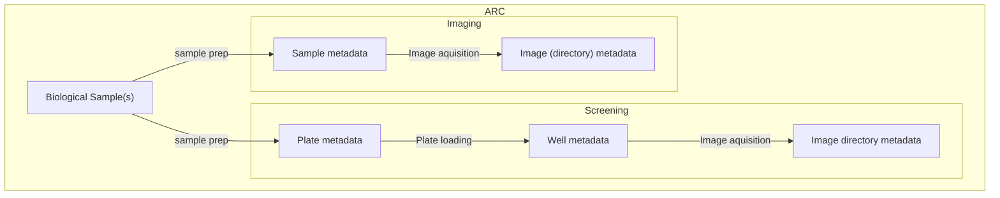
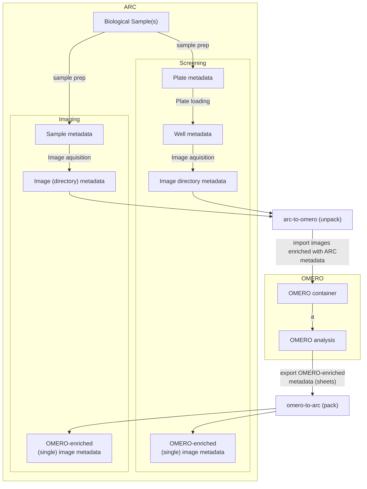

## 12/12/23: ARC <-> OMERO Roundtrip Proposal

### 1. Introduction

In the cologne pre-hackathon, 2 basic OMERO container use cases that should be depicted in the ARC have been identified: 

- Project-Dataset

  - `Project` maps to `Study` (1to1)

  - `Datasets` maps to `Assays` (NtoN)

  - `Images` are `Rows` (NtoN)

- Screen-Plate-Well

  - `Screen` maps to `Study` (1to1)

  - `Plates` map to an `Assay` (Nto1)

  - `Wells` map to `Materials` in the process Graph (NtoN) (Exact location in ARC tbd)

  - `Well location` is mapped to a `Parameter` of the process ()

  - `Images` are `Rows` (NtoN), being measurement outputs of the `Well`

## awdadw

In general, we want to avoid re-implementing OMERO (analysis) features in the ARC. Since experimenters will have to look at their images, we want to keep the OMERO client as the main interface for this. This also means that image-level metadata cannot be annotated in the arc context before looking at the images in the OMERO client. This leads to the proposition of introducing OMERO import/export as a metadata enrichment process:

## Detailed example (Screen-Plate-Well)

### Screen = Study (Sample preparation)

This is the `Screen` equivalent that tracks sample provenance in the arc context (sample preparation metadata). It is a `Study` in the arc context.

> In this study, two tissues are screened for a phenotype. The samples come from two different organisms.

|Input [Source Name]|Characteristic [Organism]|Output [Sample Name]|
|---|---|---|
tissue_1 | arabidopsis thaliana | sample_at_1
tissue_2 |  mus musculus| sample_mm_1

### Plate = Assay

#### Plate loading sheet

This is the `Plate` equivalent that tracks plate metadata in the arc context. It is an `Assay` in the arc context.

> In this assay, the samples are loaded onto a plate. The plate is a 96-well plate. 

| Input [Sample name] |Parameter [agent amount] | Output |
|--|--|--|
| sample_at_1 | 10mg | Well_ID_1_A1 |
| sample_at_1 | 10mg | Well_ID_1_A2 |
| sample_at_1 | 20mg | Well_ID_1_A3 |
| sample_mm_1 | 10mg | Well_ID_1_B1 |
| sample_mm_1 | 10mg | Well_ID_1_B2 |
| sample_mm_1 | 20mg | Well_ID_1_B3 |

#### Image acquisition sheet